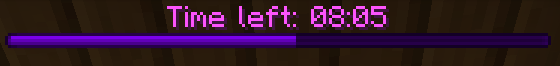

# MC Build Battle Tools
This is a collection of python scripts and tools I'm writing for my semi-regular(?) Build Battle events for [Coney Poney](https://discord.gg/coneyponey).
These are designed for my personal use, and as such, are simple CLI scripts that interface over RCON, a communication protocol used by Minecraft for remote administration.

So far, I have the following scripts:

- **mctimer.py**: A simple timer. Can be supplied with an integer argument to specify duration in seconds.

- **teleport.py**: A teleporter script for sending a player to a specific arena. Can be supplied with a playername and arena ID, or used standalone with the fzf prompt
---

## Requirements

- Python 3.9
- rcon: `pip install rcon`
- pyfzf: `pip install pyfzf`
